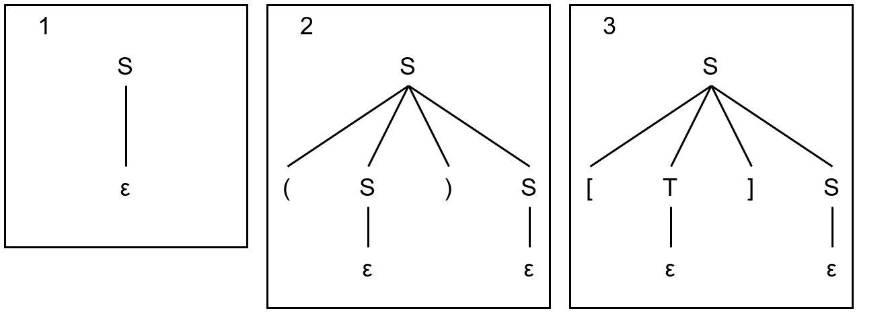
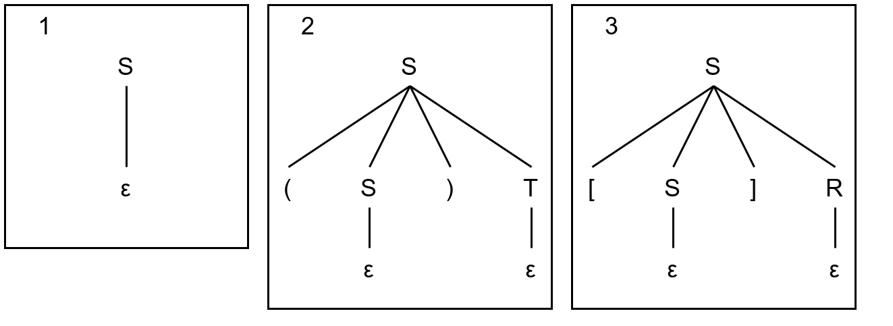

# 1

S &rarr; (S)S | [T]S | &epsi;  
T &rarr; [T]S | &epsi;  

1. &epsi;  
S &rarr; &epsi;  

2. ()  
S &rarr; (S)S &rarr; ()S &rarr; ()

3. []  
S &rarr; [T]S &rarr; []S &rarr; []

[()], ([()]) &mdash; цепочки не из языка.

# 2

S &rarr; [T]S | &epsi;  
T &rarr; (S)S | [T]S | &epsi;

1. &epsi;  
S &rarr; &epsi;

2. []  
S &rarr; [T]S &rarr; []S &rarr; []

3. [()]  
S &rarr; [T]S &rarr; [(S)S]S &rarr; [()S]S &rarr; [()]S &rarr; [()]

(), \ &mdash; цепочки не из языка.

# 3

S &rarr; (S)T | [S]R | &epsi;  
T &rarr; [S]R | &epsi;  
R &rarr; (S)T | &epsi;

1. &epsi;  
S &rarr; &epsi;

2. ()  
S &rarr; (S)T &rarr; ()T &rarr; ()

3. []  
S &rarr; [S]R &rarr; []R &rarr; []

()(), [][] &mdash; цепочки не из языка.