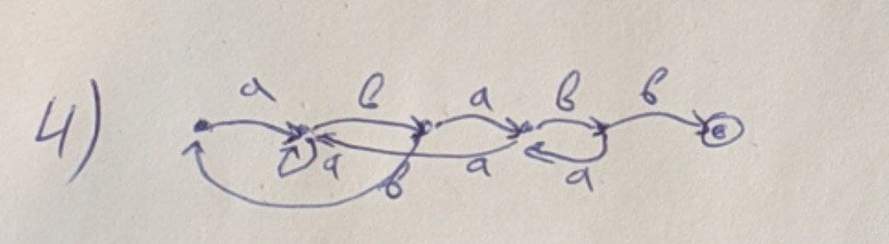

# HW 03. Ефимов Максим

## Задание 3
Построить минимальный конечный автомат, распознающий язык натуральных чисел в десятичной системе без лидирующих нулей, делящихся на 4 и имеющих сумму цифр, равную 2.
### Решение
Если в числе есть цифра больше 2 слово не принимается.

## Задание 4
Построить минимальный полный конечный автомат, распознающий язык `{w \in {a,b}* | |w|_a <= 2, |w|_b >= 2}`
### Решение
