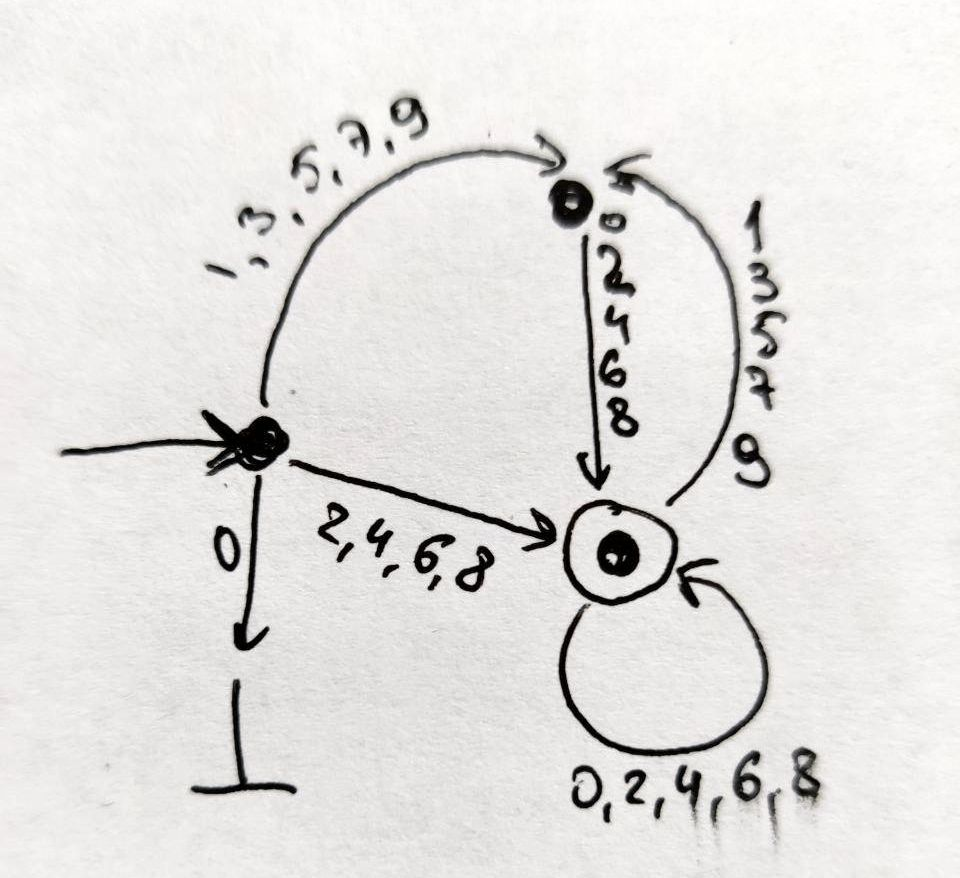
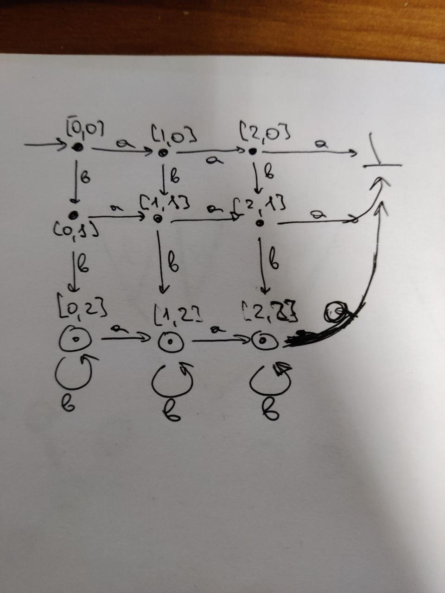

# Задача 2

Пусть `L = { a, ab }`, `R = { cb, c }` 

Тогда `L^r = { a, ba }` и `R^r = { bc, c }`.

`LR^r = { abc, ac, abbc } -> |LR^r| = 3`

`L^rR = { acb, ac, bacb, bac } -> |L^rR| = 4`

Отсюда `|L^rR| != |LR^r|`

# Задача 3

# Задача 4

